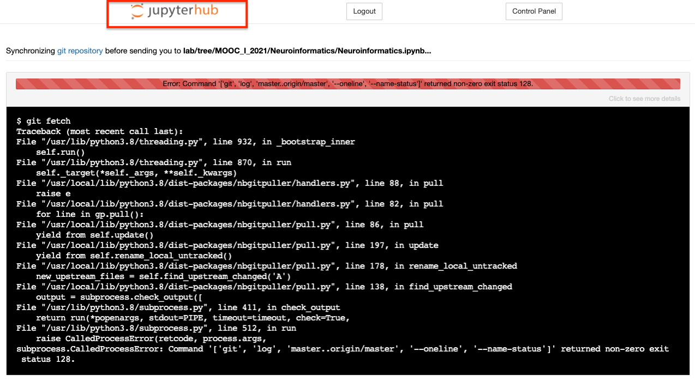
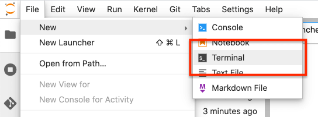

# In case you have an issue opening the notebooks from Edx

### If you don't have any changes that you want to keep (this will reset the repo)
1) Press JupyterLab on the top left corner



2) Open a new terminal:
`File > New > Terminal`



3) Remove the repo:
In the termianl window run `rm -drf MOOC-neurons-and-synapses`

# In case you have an issue with the submission widget

For the submission, you can just use simple python code to POST to Edx.

```python
import requests
import json

ENDPOINT = 'https://bbp.epfl.ch/edx-grader/answer'

SUBMISSION_KEY = 'EDX_SUBMISSION_KEY'
ANSWERS = 'YOUR_ANSWER'

data = {
  'submission_token': SUBMISSION_KEY,
  'answer': json.dumps(ANSWERS),
}

try:
  response = requests.post(ENDPOINT, json=data, verify=False)
except ValueError:
  print('Error sending the answers')

if response.status_code == requests.codes.ok:
  grade = response.json()['grade']
  print('Your answer was submitted successfully!')
  print('GRADE: {}'.format(grade['value']))
else:
  print(response.json()['message'])
```
