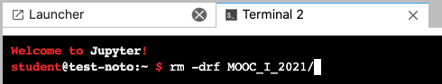

## In case you have an issue opening the notebooks from Edx

### If you don't have any changes that you want to keep (this will reset the repo)
1) Press JupyterLab on the top left corner

2) Open a new terminal (File > New > Terminal)

3) Remove the repo (rm -drf MOOC_I_2021)

